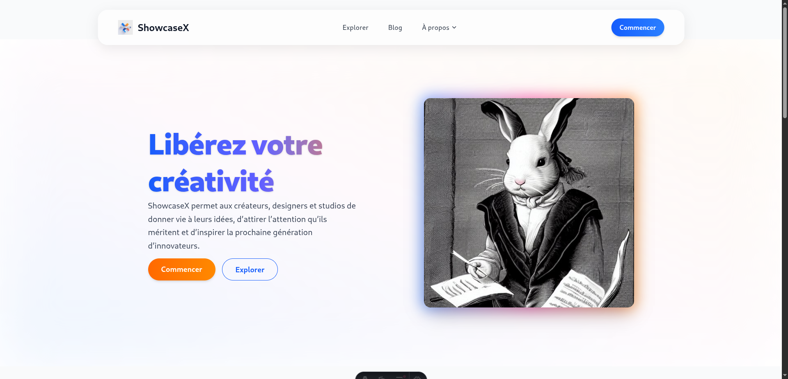

# 🌌 ShowcaseX — Plateforme de mise en avant créative

Bienvenue dans **ShowcaseX**, une plateforme conçue avec **Astro**, **TailwindCSS** et **Framer Motion** pour offrir une expérience fluide, moderne et inspirante.  
Ce projet permet aux **designers**, **créateurs** et **studios** de partager leurs œuvres et d’exposer leurs conceptions les plus remarquables.

---

## ✨ Aperçu du projet



ShowcaseX met l’accent sur :
- Une interface **sobre, élégante et animée** ;
- Des **sections modulaires** (Héros, FAQ, Galerie, Design Showcase) ;
- Une intégration **responsive** et **optimisée** ;
- Une architecture prête pour la **connexion à Supabase** et la **gestion des créateurs**.

---

## 📂 Structure du projet

Voici la structure principale du projet :

```
├── public
│   ├── images
│   │   ├── icons
│   │   │   └── show.png
│   │   ├── 1.jpeg
│   │   ├── 2.png
│   │   └── image.png
│   └── favicon.svg
├── src
│   ├── assets
│   │   ├── astro.svg
│   │   └── background.svg
│   ├── components
│   │   ├── jsxComponents
│   │   │   ├── FAQBlock.jsx
│   │   │   └── SecondaryGallery.jsx
│   │   ├── sections
│   │   │   ├── DesignShowcase.astro
│   │   │   ├── HeroSection.astro
│   │   │   └── SectionFaq.astro
│   │   ├── ux
│   │   ├── Footer.jsx
│   │   └── NavigationBar.jsx
│   ├── data
│   │   └── designs.js
│   ├── layouts
│   │   └── Layout.astro
│   ├── pages
│   │   ├── design
│   │   │   └── [slug].astro
│   │   └── index.astro
│   ├── scripts
│   └── styles
│       └── global.css
├── .gitignore
├── LICENSE
├── README.md
├── astro.config.mjs
├── package-lock.json
├── package.json
└── tsconfig.json
```


````markdown
# 🎨 Showcase — Vitrine créative Astro + React

Un projet **Astro** moderne conçu pour présenter des **interfaces innovantes**, des **concepts UI/UX** et des **designs futuristes**.  
Pensé pour la performance, la modularité et une expérience fluide grâce à **Framer Motion**.

---

## 🚀 Installation du projet

```bash
git clone https://github.com/AndrixNg1/ShowcaseX.git
cd git clone https://github.com/AndrixNg1/ShowcaseX.git
npm install
npm install @astrojs/react react react-dom
npx astro add react
````

---

## ⚙️ Commandes disponibles

Toutes les commandes se lancent depuis la racine du projet :

| Commande                  | Action                                                  |
| :------------------------ | :------------------------------------------------------ |
| `npm install`             | Installe les dépendances nécessaires                    |
| `npm run dev`             | Lance le serveur local à `localhost:4321`               |
| `npm run build`           | Compile le site pour la production dans `./dist/`       |
| `npm run preview`         | Prévisualise le site compilé avant déploiement          |
| `npm run astro ...`       | Exécute les commandes CLI comme `astro add`, `check`, … |
| `npm run astro -- --help` | Affiche l’aide pour la CLI Astro                        |

---

## 🚀 Technologies utilisées

* **Astro** – Framework moderne orienté performance et modularité
* **TailwindCSS** – Système de styles rapide et responsive
* **Framer Motion** – Animations fluides et intuitives
* **Lucide Icons** – Pack d’icônes vectorielles modernes

---

## 🧩 Exemple de commit Git

```bash
git add .
git commit -m "✨ Ajout de la section Showcase avec animations Framer Motion et support React"
git push -u origin main
```

---

## 💡 Contribuer

Toute contribution est la bienvenue !
Tu peux ouvrir une *issue* ou proposer une *pull request* sur la branche dev pour :

* Corriger un bug
* Améliorer le design
* Ajouter une nouvelle section

---

## 🪐 Licence

Ce projet est sous licence **MIT** — utilisation libre, à condition de mentionner l’auteur.

---

### ✍️ Auteur

Développé avec passion par **Andrix Ngoyi**

> *“L’innovation ne réside pas dans la complexité, mais dans la clarté de l’exécution.”*
